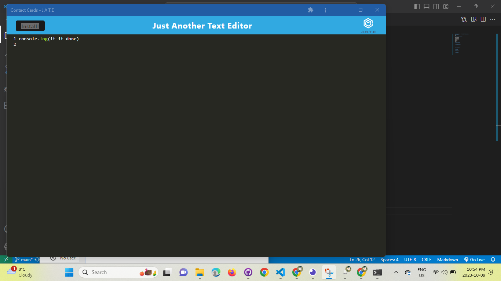

##  TITLE ###     Text-EDITOR1License:

## License: 
MIT

## Table of contents:
Description
Installation
Usage
Contribution
Testing
Demo:

## Description:
 build a text editor that runs in the browser. The app will be a single-page application that meets the PWA criteria. Additionally, it will feature a number of data persistence techniques that serve as redundancy in case one of the options is not supported by the browser. The application will also function offline.
 

## Heroku Link:
 The application has been deployed to Heroku and the URL of the deployed application is:-

 
## Installation:
This text editor require a number of methods and store data to an IndexedDB database to be builded up.
This application will require the installation of Node.js and various npm packages.
This application will use the following npm packages:-
npm install express (express.js)
npm install --save-dev webpack (Webpack)
npm install webpack-dev-server --save-dev (webpack-dev-server)
npm install --save-dev webpack-pwa-manifest (WebpackPwaManifest)
npm install babel (Babel) npm install --save-dev css-loader (CSS-loader)
npm install concurrently --save (run multiple commands concurrently.) (Concurrently)
npm npm install idb (IndexedDB)

## screenshot:
!
[Alt text](image-1.png)!
[Alt text](image-2.png)!
[Alt text](image-3.png)!
[Alt text](image-4.png)!
[Alt text](image-5.png)!
[Alt text](image-6.png)

## Usage:

AS A developer
I WANT to create notes or code snippets with or without an internet connection
SO THAT I can reliably retrieve them for later use
## Acceptance Criteria

GIVEN a text editor web application
WHEN I open my application in my editor
THEN I should see a client server folder structure
WHEN I run `npm run start` from the root directory
THEN I find that my application should start up the backend and serve the client
WHEN I run the text editor application from my terminal
THEN I find that my JavaScript files have been bundled using webpack
WHEN I run my webpack plugins
THEN I find that I have a generated HTML file, service worker, and a manifest file
WHEN I use next-gen JavaScript in my application
THEN I find that the text editor still functions in the browser without errors
WHEN I open the text editor
THEN I find that IndexedDB has immediately created a database storage
WHEN I enter content and subsequently click off of the DOM window
THEN I find that the content in the text editor has been saved with IndexedDB
WHEN I reopen the text editor after closing it
THEN I find that the content in the text editor has been retrieved from our IndexedDB
WHEN I click on the Install button
THEN I download my web application as an icon on my desktop
WHEN I load my web application
THEN I should have a registered service worker using workbox
WHEN I register a service worker
THEN I should have my static assets pre cached upon loading along with subsequent pages and static assets
WHEN I deploy to Heroku
THEN I should have proper build scripts for a webpack application

## Testing:
No tests were run to complete this CMS.

## Contact:
If you have any questions about the repo,you can contact me
# Github:https://github.com/phvania
# Email: vaniapriti@gmail.com 

